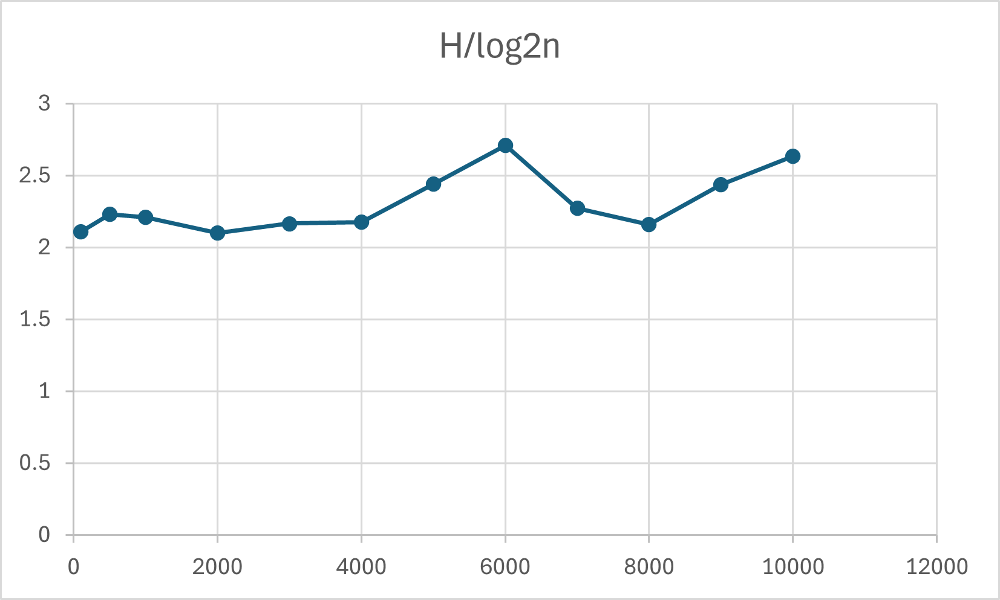

# 41343110 
# Quit_1 Max/Min Heap


## 解題說明
本題目要求實作一個 最小優先佇列（Min Priority Queue），並使用 最小堆積（Min Heap） 作為底層資料結構。

### 解題策略
#### 資料結構
- Min Priority Queue 抽象類別
- MinHeap 類別設計
#### 主要操作方法
1.插入元素（Push):當新元素加入時，先放在陣列最後，再進行「向上調整（Heapify Up）」：
- 與父節點比較
- 若較小則交換
- 重複直到符合 MinHeap 性質

2.刪除最小值（Pop:最小值位於根節點（heap[1]），刪除後：
- 以最後一個元素補上根節點
- 進行「向下調整（Heapify Down）」
- 與較小子節點比較並交換

3.取得最小值（Top）
```cpp
  heap[1]
```

4.動態擴充（Resize):當陣列空間不足時：
- 建立新陣列（容量加倍）
- 複製原資料

## 程式實作
```cpp
#include <iostream>
#include <string>
using namespace std;

template <class T>
class MinPQ {
public:
    virtual ~MinPQ() {}
    virtual bool IsEmpty() const = 0;
    virtual const T& Top() const = 0;
    virtual void Push(const T&) = 0;
    virtual void Pop() = 0;
};

template <class T>
class MinHeap : public MinPQ<T> {
private:
    T* heap;
    int capacity;
    int size;

    void Resize() {
        capacity *= 2;
        T* newHeap = new T[capacity + 1];
        for (int i = 1; i <= size; i++)
            newHeap[i] = heap[i];
        delete[] heap;
        heap = newHeap;
    }

public:
    MinHeap(int cap = 10) {
        capacity = cap;
        heap = new T[capacity + 1]; //  index從1開始
        size = 0;
    }

    ~MinHeap() {
        delete[] heap;
    }

    bool IsEmpty() const {
        return size == 0;
    }

    const T& Top() const {
        if (IsEmpty())
            throw runtime_error("Heap is empty");
        return heap[1];
    }

    void Push(const T& x) {
        if (size + 1 == capacity)
            Resize();

        int i = ++size;

        while (i != 1 && x < heap[i / 2]) {
            heap[i] = heap[i / 2];
            i /= 2;
        }

        heap[i] = x;
    }

    void Pop() {
        if (IsEmpty())
            throw runtime_error("Heap is empty");

        T last = heap[size--];

        int parent = 1;
        int child = 2;

        while (child <= size) {
            if (child < size && heap[child] > heap[child + 1])
                child++;

            if (last <= heap[child])
                break;

            heap[parent] = heap[child];
            parent = child;
            child *= 2;
        }

        heap[parent] = last;
    }
    void PrintByIndex() const {
        for (int i = 1; i <= size; i++) {
            cout << heap[i] << " ";
        }
        cout << endl;
    }
};

int main() {
    MinHeap<int> h;

    int n, x;
    cout << "輸入元素個素:";
    cin >> n;
    cout << "輸入元素:";
    for (int i = 0; i < n; i++) {
        cin >> x;
        h.Push(x);
    }

    cout << "依 index 輸出: ";
    h.PrintByIndex();

    return 0;
}
```
## 效能分析
### 時間複雜度
- 插入操作（Push）:插入新元素時，需進行向上調整
```cpp
O(log n)
```
- 刪除最小值（Pop）:刪除 root 後，需進行向下調整
```cpp
O(log n)
```
- 取得最小值（Top）:直接存取根節點
```cpp
O(1)
```
- 判斷是否為空（IsEmpty）:僅檢查 size
```cpp
O(1)
```
### 空間複雜度
- 使用陣列儲存：O(n)
- 動態擴充後仍為：O(n)
## 測試與驗證

### 測試案例
| 測試案例 | 輸入參數   | 預期輸出 | 實際輸出 | 
|----------|--------------|----------|----------|
| 測試一   |   5 10 4 15 2 8   |     依 index 輸出: 2 4 15 10 8       |     依 index 輸出: 2 4 15 10 8    | 

### 結論
本題成功以 MinHeap 實作最小優先佇列，透過陣列表示完全二元樹，並利用向上調整與向下調整維持堆積性質，使得各項操作皆能有效率地完成。
## 申論及開發報告

### 開發目的

本程式的目標是以最小堆（MinHeap）實作一個最小優先佇列（MinPQ）的抽象介面，提供以下基本操作:
- IsEmpty()：判斷優先陣列是否為空
- Top()：取得目前最小元素（不刪除）
- Push(x)：插入一個新元素
- Pop()：刪除目前最小元素 -（額外功能）PrintByIndex()：以陣列索引順序輸出堆的內容（用於檢查）
### 開發環境與語言
- 語言：C++
- 編譯器：g++ / clang++（建議 C++11 以上）
- 主要標頭：<iostream>, <string>（備註：程式有用到 runtime_error，建議補上 #include <stdexcept> 以符合標準。）
### 資料結構與設計概念
- 最小堆（Min-Heap）性質,最小堆是一種完全二元樹，滿足：
  - 每個節點的值 <= 其子節點的值 
  - 因此根節點（root）永遠是最小值
- 陣列表示法,本程式用動態陣列 heap[] 存堆，並從索引 1 開始（常見寫法）：
  - heap[1]：根（最小值）
  - 對於索引 i：
    - parent = i/2
    - left child = 2*i
    - right child = 2*i + 1
### 模組設計與類別說明
- 抽象介面 MinPQ<T>
  使用 virtual 宣告純虛函式，定義最小優先佇列應有的行為，讓不同實作（例如 heap、leftist heap 等）可以共用同一套介面。

- 具體實作 MinHeap<T>
  主要成員：

    - T* heap：存資料的動態陣列
    - int capacity：容量
    - int size：目前元素量（堆大小）
    - 並提供：
      - Resize()：當容量不足時，將容量倍增並搬移資料
# Quit_2 Binary Search Tree

## 解題說明
### (a)
### 題目說明 
本程式主要在探討 二元搜尋樹（Binary Search Tree, BST）在隨機插入情況下的高度變化
### 實作方法
- 建立一棵 空的 Binary Search Tree (BST)
- 插入 n 個隨機數
- 計算樹的高度 height: h(n)=1+max(h(left),h(right))
- 計算比值：height/ $\log_2 n$ 

### (b)
### 題目說明 
寫一個 C++ 函式，在 Binary Search Tree（BST，二元搜尋樹） 中：
- 給定一個 key k
- 把 key = k 的那個節點（pair）從 BST 刪掉
- 刪除後樹仍然要符合 BST 性質：
  - 左子樹所有 key 都 < 此節點 key
  - 右子樹所有 key 都 > 此節點 key
### 實作方法
- 要刪的節點是葉節點（沒有子樹）：直接刪掉
- 只有一個子樹：用那個子樹頂替被刪節點的位置
- 有兩個子樹：用「中序後繼」（右子樹最小值）或「中序前驅」（左子樹最大值）來替換，再把那個後繼/前驅節點刪掉
## 程式實作
### (a)
```cpp
#include <iostream>
#include <cmath>
#include <cstdlib>
#include <ctime>
using namespace std;

struct Node {
    int key;
    Node* left;
    Node* right;
    Node(int k) : key(k), left(nullptr), right(nullptr) {}
};

Node* insert(Node* root, int key) {
    if (!root) return new Node(key);

    if (key < root->key) root->left = insert(root->left, key);
    else if (key > root->key) root->right = insert(root->right, key);
    
    return root;
}

int height(Node* root) {
    if (!root) return 0;
    int hl = height(root->left);
    int hr = height(root->right);
    return 1 + (hl > hr ? hl : hr);
}

void destroy(Node* root) {
    if (!root) return;
    destroy(root->left);
    destroy(root->right);
    delete root;
}

// Fisher–Yates shuffle
void shuffleArray(int* a, int n) {
    for (int i = n - 1; i > 0; --i) {
        int j = rand() % (i + 1);
        int tmp = a[i];
        a[i] = a[j];
        a[j] = tmp;
    }
}

int main() {
    srand((unsigned)time(nullptr)); 

    int ns[] = { 100, 500, 1000, 2000, 3000, 4000, 5000, 6000, 7000, 8000, 9000, 10000 };

    for (int idx = 0; idx < (int)(sizeof(ns) / sizeof(ns[0])); ++idx) {
        int n = ns[idx];
        Node* root = nullptr;

        
        int* arr = new int[n];
        for (int i = 0; i < n; ++i) arr[i] = i + 1;

       
        shuffleArray(arr, n);
        for (int i = 0; i < n; ++i) {
            root = insert(root, arr[i]);
        }

        int h = height(root);
        double ratio = h / log2((double)n);

        cout << "n = " << n
            << ", height = " << h
            << ", height/log2(n) = " << ratio << "\n";

        delete[] arr;
        destroy(root);
    }

    return 0;
}
```
###  (b)
```cpp
using namespace std;

struct Node {
    int key;
    Node* left;
    Node* right;
    explicit Node(int k) : key(k), left(nullptr), right(nullptr) {}
};

static Node* findMin(Node* node) {
    while (node && node->left) node = node->left;
    return node;
}

Node* deleteKey(Node* root, int k) {
    if (!root) return nullptr;

    if (k < root->key) {
        root->left = deleteKey(root->left, k);
    } else if (k > root->key) {
        root->right = deleteKey(root->right, k);
    } else {
        // 找到要刪的節點 root
        if (!root->left && !root->right) {
            delete root;
            return nullptr;
        }
        if (!root->left) {
            Node* r = root->right;
            delete root;
            return r;
        }
        if (!root->right) {
            Node* l = root->left;
            delete root;
            return l;
        }

      
        Node* succ = findMin(root->right);
        root->key = succ->key;
        root->right = deleteKey(root->right, succ->key);
    }
    return root;
}
```
## 效能分析
### (a)
### 時間複雜度
- 插入與搜尋時間複雜度:BST 的時間複雜度取決於樹的高度

|高度| 時間複雜度  |
|----------|--------------|
| $\log_2 n$ | O(logn) |
|  n |  O(n)|


### 空間複雜度
- 每個節點：𝑂(1)
- 總空間：𝑂(𝑛)

### (b)
### 時間複雜度
deleteNode 效能:刪除操作時間複雜度：O(h)
|程式|高度| 時間複雜度  |
|----------|--------------|--------------|
|deleteKey()|h|O(h)|
## 測試與驗證
| 測試案例 | 輸入參數 n   | 預期輸出  height, height/ $\log_2 n$  | 實際輸出 height, height/  $\log_2 n$ | 
|----------|--------------|----------|----------|
| 測試一   |   100    |  13,1.95669        |   13,1.95669    | 
| 測試二   |    500   |    19,2.11917    |   19,2.11917    | 
| 測試三  |    1000   |     23,2.3079    |  23, 2.3079     | 
| 測試四  |  2000     |     27,2.4622   |   27,2.4622| 
| 測試五  |  3000     |    27,2.33751    |  27,2.33751    | 
| 測試六  |   4000    |    30,2.50715   |  30,2.50715   | 
| 測試七  |   5000    |      27,2.19732   |   27,2.19732     | 
| 測試八 | 6000    |     29,2.31062   |    29,2.31062   | 
| 測試九   |  7000     |   27,2.11381      |    27,2.11381 | 
| 測試十   |    8000  |    32,2.46803     |    32,2.46803 | 
| 測試十一|    9000   |    32,2.43611     |    32,2.43611  | 
| 測試十二   |    10000   |    34,2.55875     |   34,2.55875   | 
### 線性圖

## 結論
本程式顯示，在資料輸入下，二元搜尋樹的高度趨近於 𝑂(log⁡𝑛)但在極端情況下仍可能退化為 𝑂(𝑛)，因此實務上常需使用平衡樹以維持穩定效能。

- (a) 實驗結果顯示 height/ $\log_2 n$ 接近常數，支持 BST 在隨機插入下高度為 Θ(log n) 的性質。
- (b) BST 刪除操作的效能主要受樹高影響，時間複雜度為 O(h)，平均 O(log n)，最差 O(n)。

## 申論及開發報告
### 開發目的
本次開發目標為完成二元搜尋樹（Binary Search Tree, BST）的兩項任務：
(a) 隨機插入實驗：
- 從空 BST 開始，對不同規模 n 進行隨機插入並量測樹高 height，計算 height/log2(n)，驗證此比值是否近似常數。

(b) BST 刪除功能：
- 撰寫 C++ 函式刪除 key 為 k 的節點，並分析該函式的時間複雜度。
### 開發環境與工具
- 語言：C++
- 編譯環境：g++ / clang++（C++11 以上皆可）
- 主要使用標頭：
  - (a) iostream, cmath, cstdlib, ctime（不使用 unordered_set）
  - (b) iostream
### 系統設計與資料結構
- 節點結構（Node）
  - key：用於 BST 排序的鍵
  - left：左子樹指標
  - right：右子樹指標 
### 模組設計
- 隨機插入資料的產生策略
  - 建立 1~n 的序列（保證不重複）
  - 使用 Fisher–Yates Shuffle 產生隨機排列
  - 依排列順序插入 BST
- 高度定義與計算,高度採用節點層數定義：
  - 空樹高度 = 0
  - 非空樹高度 = 1 + max(leftHeight, rightHeight)
- 輸出與資料整理,程式輸出每筆測試資料包含：
  - n
  - height
  - height/log2(n)
